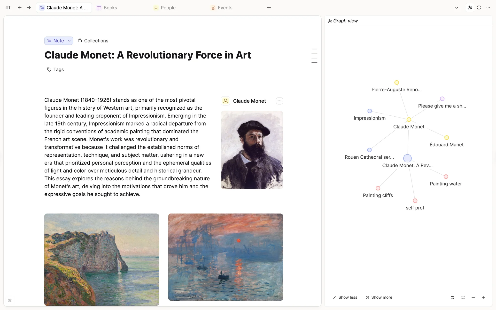
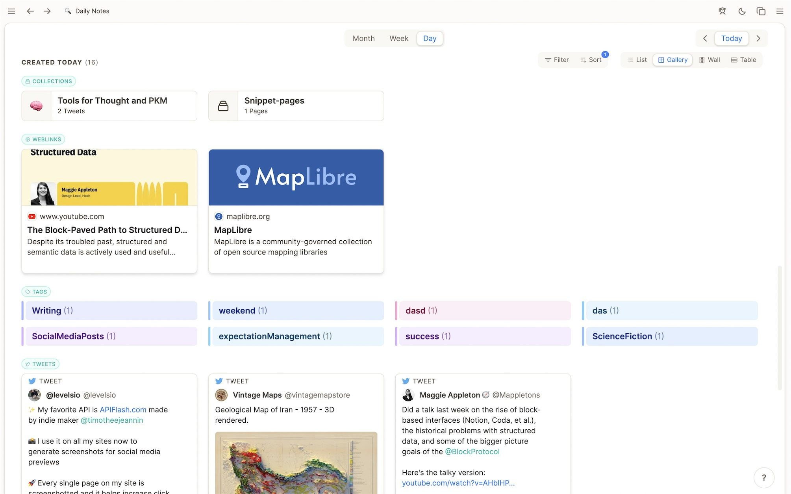
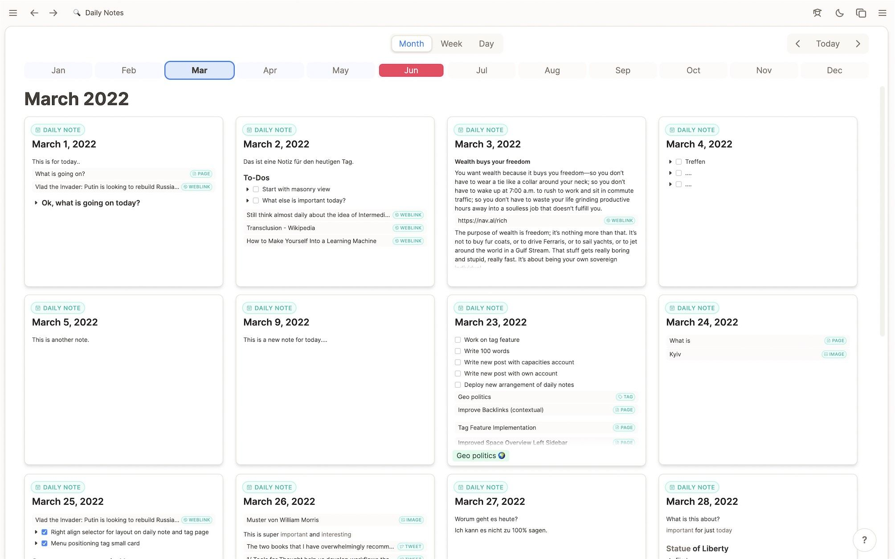
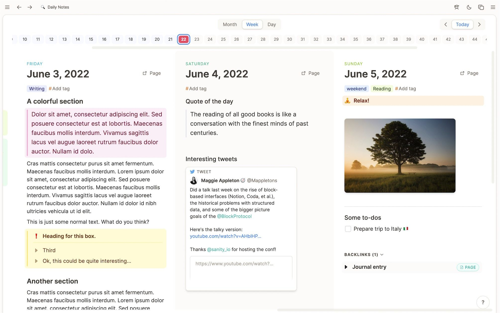
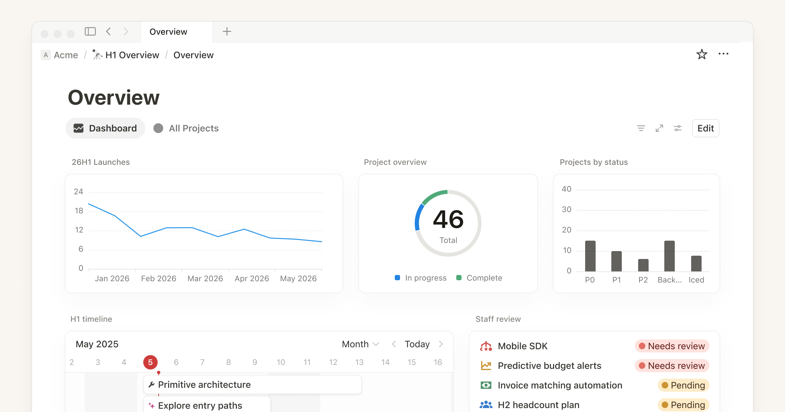
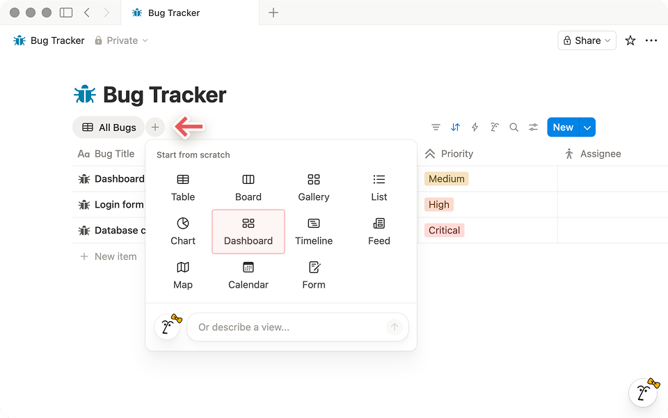
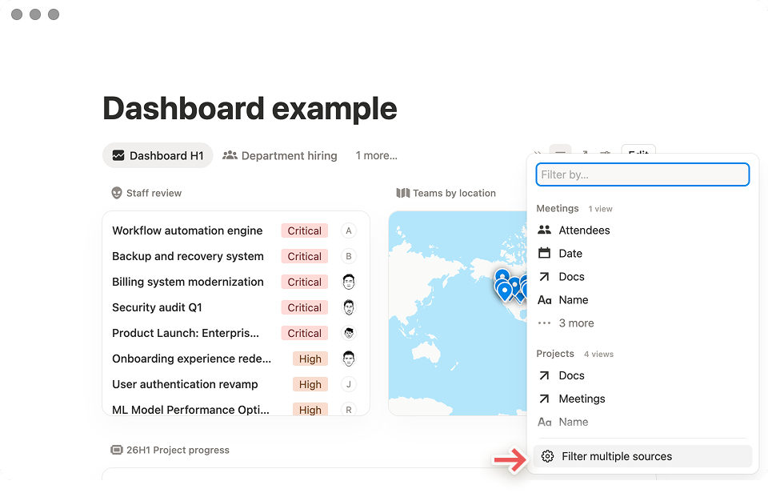

# Design Research: 요한 OS PKM 대시보드

> 1인 크리에이터/개발자용 로컬 SoT(memory/) 탐색·시각화·실행 허브 — Next.js + Vercel 데스크톱/웹 우선

## TL;DR

**3-pane "도서관형" 레이아웃을 기본으로 채택하라**: 좌측 224px 고정 사이드바(타입/컬렉션 트리) + 가운데 컨텐츠 캔버스 + 우측 ~320px 컨텍스트 레일(그래프 미니뷰·백링크·메타). 홈 대시보드는 **타입별로 그룹화된 카드 그리드**(Capacities "Created Today" 패턴)로 구성하고, 시각화는 **데일리 노트를 허브**로 삼아 Week/Month 오버뷰가 자연스럽게 따라오게 한다. **Cmd+K 커맨드 팔레트**는 1주차 안에 반드시 넣어라 — SoT 진입점 중 가장 빠른 길이고, 로컬 파일 시스템을 가진 너의 제품이 노션보다 명확히 우월할 수 있는 부분이다.

## Recommendations / Next Steps

각 항목은 아래 *Findings*의 증거에 직접 연결된다. 우선순위 순.

### 1. 3-pane 레이아웃 + 224px 고정 사이드바

Notion이 검증한 치수를 그대로 빌려 시작 비용을 줄여라. 사이드바 너비 224px, 아이콘 컨테이너 22px 정사각, 검색바 30px 높이, 8px 그리드, 8px 라운드 — 이 수치들은 "정보 밀도와 클릭 편의의 최적점"이라는 Notion의 6년치 실험 결과다 (사이드바 분석 참고). 이를 기반으로 **상단 4개 키 슬롯**(Search · AI · Home · Inbox)을 132px 영역에 묶고, 그 아래 **타입 트리 / 컬렉션 / 즐겨찾기**를 배치한다. 사이드바 우측에는 Capacities처럼 **세로 타입 컬러 인디케이터**(작은 좌측 보더)를 노출해 비개발자·시각 학습자에게 SoT 구조를 무의식적으로 학습시켜라.

```
┌──────────────────────────────────────────────────────────────────────┐
│ [Y] 요한 OS                                            ⌘K   ☼  ◐    │
├────────────┬───────────────────────────────────┬────────────────────┤
│ 🔎 Search  │  데일리 노트 — 2026-05-06 (수)      │  ◯◯◯ Graph       │
│ ✨ AI      │                                   │   (this note)      │
│ 🏠 Home    │  # 오늘의 메모                     │ ╭──────────────╮  │
│ ✉ Inbox   │  ...                               │ │  •●●         │  │
│ ───────── │                                    │ │  ●  ●        │  │
│ TYPES     │  ## 연결                            │ │ ●     ●      │  │
│ │ Note    │  ▸ ADR-2026-05                     │ ╰──────────────╯  │
│ │ ADR     │  ▸ Insight: MCP Ch.15              │                    │
│ │ Insight │                                    │  ⤴ Backlinks (3)   │
│ │ Person  │                                    │  ▸ ADR-2026-04     │
│ ───────── │                                    │  ▸ Curriculum log  │
│ ⭐ Pinned  │                                    │                    │
│ ▾ today   │                                    │  ◧ Meta            │
│ ▾ active  │                                    │  type: daily-note  │
└────────────┴────────────────────────────────────┴────────────────────┘
   224 px               flex                              ~320 px
```

### 2. 홈 = 타입별 카드 그리드 (Capacities "Created Today" 패턴)

Notion의 12-위젯 대시보드는 멀티 프로젝트 요약에는 좋지만 **개인 PKM**에는 너무 비즈니스-같다. 너의 SoT는 **타입(Note / ADR / Insight / Person / Source)별로 묶어 보여주는 게 정체성**이다. Capacities의 데일리노트 "Created Today (16)" 스크린은 정확히 그 패턴 — Collections / WebLinks / Tags / Tweets로 **수평 섹션**, 각 섹션 안에 **갤러리/리스트/월/테이블** 토글. 너의 홈도:

- **Today** (오늘 SoT에 들어온 것: ADR / Insight / Note 카운트)
- **Recent by type** (타입별 최근 5개 — 색상 칩으로 구분)
- **Pinned** (수동 고정)
- **Graph snapshot** (현재 컨텍스트 미니 그래프, 클릭 시 풀 뷰)
- **Quick capture** (인박스 1줄 입력)

```
┌─ Home ───────────────────────────────────────────────────────────────┐
│                                                                      │
│  Today  ─ 6 items                                       [Filter ▾]  │
│  ┌──────────┐ ┌──────────┐ ┌──────────┐ ┌──────────┐                │
│  │ ADR ●    │ │ INSIGHT●│ │ NOTE   ● │ │ PERSON ● │                │
│  │ session  │ │ MCP15   │ │ daily   │ │ +2 more  │                │
│  └──────────┘ └──────────┘ └──────────┘ └──────────┘                │
│                                                                      │
│  Recent ── by type                                       [Type ▾]   │
│  ╭─ ADR ─────╮  ╭─ Insight ─╮  ╭─ Note ────╮  ╭─ Source ─╮          │
│  │ 1) sync   │  │ 1) ch15   │  │ 1) today  │  │ 1) curr  │          │
│  │ 2) records│  │ 2) ch14   │  │ 2) yest   │  │ 2) gh-rt │          │
│  │ ...       │  │ ...       │  │ ...       │  │ ...      │          │
│  ╰───────────╯  ╰───────────╯  ╰───────────╯  ╰──────────╯          │
│                                                                      │
│  ╭─ Graph (this week) ───────────╮   ╭─ Quick capture ─────────╮    │
│  │     ●●  ●                     │   │ + 빠른 메모...           │    │
│  │   ●●  ●●                      │   │                          │    │
│  │  ● ●●                         │   │ [type ▾] [submit ⏎]      │    │
│  ╰───────────────────────────────╯   ╰──────────────────────────╯    │
└──────────────────────────────────────────────────────────────────────┘
```

### 3. Cmd+K 커맨드 팔레트 — 1주차 안에

Linear / Notion / Raycast / Vercel — 모든 모던 SaaS의 표준이다. 키보드 중심 사용자에겐 사이드바보다 빠르고, 시각 학습자에게도 **"이 앱에서 뭘 할 수 있는지" 디스커버리**가 된다 (Outdraw UX Patterns 분석 참고). 너의 컨텍스트에서 의미 있는 슬래시 명령은:

- `/jump <title>` — 노드 즉시 이동 (퍼지 검색)
- `/new note | adr | insight` — 타입 지정 생성
- `/tag <name>` — 태그 검색·필터
- `/recent` — 최근 N개
- `/graph this | week | type:X` — 그래프 뷰 진입
- `/sync notion` — 미러 채널 푸시
- `/run <hook>` — 자동화 실행

`Cmd+K`를 사이드바보다 먼저 만들어라 — 개발 단계에선 사이드바 메뉴 30개 그리는 것보다 팔레트 하나로 진입점을 통일하는 게 압도적으로 빠르다.

### 4. 그래프 뷰는 "타입 색상 + 깊이 슬라이더" 필수

Obsidian / Tana / Anytype 비교 분석의 결론: **그래프의 가치는 "포스 디렉티드 헤어볼"이 아니라 "필터된 클러스터"**다 (Medium 그래프 비교 참고). 너의 SoT 그래프는 처음부터:

1. **타입별 노드 색상** — 사이드바 색칩과 동일한 팔레트 (학습 비용 0)
2. **깊이 슬라이더** (1~3) — 기본 1, 시각 학습자가 자연스럽게 확장
3. **타입 필터 토글** — 상단 칩 클릭 (Anytype 패턴)
4. **현재 노드 하이라이트** — 우측 컨텍스트 레일의 미니 그래프와 메인 그래프가 동일 컬러/포커스

Obsidian의 풀스크린 그래프는 "감탄용", 너의 그래프는 **항상 우측 사이드 320px에 살아있어야** — 이게 비개발자에게 "지식이 연결되고 있다"는 피드백을 매 클릭마다 주는 핵심 장치.

### 5. 데일리 노트를 홈 옆 두 번째 진입점으로

Capacities의 가장 강한 차별점은 데일리 노트가 **단순한 일기가 아니라 그날의 모든 SoT 진입을 모으는 허브**라는 점이다. Week/Month/Day 토글, 월 그리드(작은 카드 28개), 타임라인 — 이 패턴은 "오늘 뭐 했지?"라는 질문에 SoT가 직접 답하게 한다. 1인 운영자에게 이건 운영 회고 그 자체.

```
Month View (28일 그리드 — Capacities 패턴)
┌─────┬─────┬─────┬─────┬─────┬─────┬─────┐
│ M 1 │ M 2 │ M 3 │ M 4 │ M 5 │ M 6 │ M 7 │
│ ●●● │ ●●  │ ●●●●│  ●  │ ●●● │     │ ●●  │
│ adr │ ins │ note│ note│ adr │     │ note│
├─────┼─────┼─────┼─────┼─────┼─────┼─────┤
│ M 8 │ M 9 │ ... │     │     │     │     │
```

각 카드는 그날 생성된 SoT 객체 카운트를 도트로 표시 (타입별 색). 클릭 → 그날의 데일리 노트로 진입.

### 6. 정보 밀도 ≠ 정보 과부하 — 점진적 노출

리서치 메타 분석 결론: **75개 연구 중 46.7%가 정보 과부하를 가장 큰 대시보드 문제로 지목**했다 (UXPilot 인용). 너의 "정보 밀도 높지만 읽기 부담 적은" 목표를 달성하려면:

- **F/Z 패턴**: 가장 중요한 메트릭(예: Today count, 미처리 인박스)은 **좌상단**
- **컨셉트 그룹화**: 같이 봐야 하는 위젯을 인접 배치 (Recent by type 4개 카드 한 줄)
- **스마트 디폴트**: 가능한 모든 데이터 표시 ❌, 추론된 "중요한 것"부터 ⭕
- **드릴다운**: 카드 클릭 → 해당 타입 풀 리스트, 호버 → 미리보기

## Key Examples

각 이미지는 위 권장사항의 직접 증거. 출처 라벨은 가져온 곳을 표시.


*Capacities — 노트 본문 + 우측 그래프 뷰 사이드바. Recommendation 1·4의 직접 모델: "이 노트는 이 개념들과 연결돼 있다"를 매 클릭마다 시각적으로 보여줌. [Web]*


*Capacities — "Created Today (16)" 타입별 섹션 그리드: Collections / WebLinks / Tags(컬러 칩) / Tweets. Recommendation 2의 핵심 패턴 — PKM 홈은 비즈니스 KPI 위젯이 아니라 타입별 컬렉션 뷰여야 한다는 증거. [Web]*


*Capacities — 28일 데일리 노트 그리드, 각 카드에 그날 만든 객체 도트. Recommendation 5의 직접 모델 — 캘린더가 아니라 "운영 로그 시각화"로 읽힘. [Web]*


*Capacities — 3일 동시 표시 주간 뷰. 1인 운영자 회고에 적합한 정보 밀도 균형의 좋은 예. [Web]*


*Notion — 12-위젯 대시보드 그리드(라인 차트 + 도넛 + 바 + 타임라인 + 상태 리스트). 참고로만 — 비즈니스적이라 PKM 홈에 그대로 적용하지 말 것 (Anti-pattern 섹션 참고). [Web]*


*Notion — 동일 데이터를 10가지 뷰(Table/Board/Gallery/List/Chart/Dashboard/Timeline/Feed/Map/Calendar/Form)로 재구성하는 모달. Recommendation 2의 "타입별 카드 안에 갤러리/리스트/테이블 토글"의 출처. [Web]*


*Notion — 여러 소스(Meetings / Projects)를 동시에 필터링하는 패널. SoT가 mirror channel(Notion/자동화)을 가질 때 쓸 수 있는 패턴. [Web]*

## Patterns

리서치한 7개 제품 모두가 공유하는 "테이블 스테이크":

- **고정 좌측 사이드바** (224~280px) — 워크스페이스명 → 검색 → 키 메뉴 → 트리
- **Cmd+K 커맨드 팔레트** — 모든 모던 PKM·생산성 앱의 표준
- **마크다운/블록 기반 본문** — Notion·Obsidian·Craft·Capacities·Anytype 전부
- **백링크 패널** — 본문 하단 또는 우측 (자동 생성, 양방향)
- **태그 시스템** — 컬러 칩, 자동완성
- **데일리 노트** — Capacities·Obsidian·Tana·Roam 다 갖춤; PKM에서 "엔트리 포인트" 역할
- **다크/라이트 테마 토글** — 헤더 우측

이 항목들은 "차별화 포인트"가 아니다. 빠지면 사용자가 "어, 이거 뭐가 빠졌네"를 느낀다.

## Anti-Patterns

리서치 중 명확히 **피해야 할** 패턴:

- **비즈니스 KPI 위젯 그리드를 PKM 홈에 그대로 가져오기** — Notion의 "프로젝트 진행률 도넛 차트" 같은 건 1인 PKM에서 노이즈. 데이터 소스가 다르다.
- **무필터 풀 그래프 뷰를 기본값으로** — Obsidian "헤어볼" 문제. 처음부터 깊이 1, 타입 필터 켜진 상태로 시작.
- **사이드바에 "모든 페이지" 무한 트리** — Notion의 가장 큰 약점. 50개 넘으면 못 찾는다. 트리는 **타입 / 즐겨찾기 / 최근**으로 제한, 나머진 검색·팔레트로.
- **위젯을 4개 이상 한 줄에 배치** — Notion 대시보드는 4-per-row까지 허용하지만 1인 PKM 화면(보통 13~16인치 노트북)에서 3개 이상이면 각 위젯이 정보를 못 담는다.
- **Linear식 키보드 단축키 폭주** — Linear는 팀 도구라 학습 곡선을 정당화한다. 1인 시각 학습자 타겟에서 단축키 30개는 망한다. Cmd+K + 5~7개 핵심 단축키만.
- **사이드바 너비 가변** — Notion은 드래그 가능하지만 위치 일관성이 떨어진다. **고정 224px**로 시작하고 토글로 collapse만 허용.

## Unique Angles

리서치하다 "오, 이거"라고 멈췄던 디테일들 — 베끼지 말고 변형해서 가져갈 후보:

- **Capacities의 타입별 좌측 컬러 보더** — 사이드바 트리에서 객체 옆에 1px 세로선만으로 타입을 표시. 기호·이모지보다 시선 노이즈가 훨씬 적다. 시각 학습자에 이상적.
- **Linear의 LCH 색공간 + 3-변수 테마** — 베이스/액센트/대비 3개로 전체 테마 생성. 너의 PKM에서 "타입별 컬러 8개"를 직접 정의하는 대신, 단일 액센트 + 타입별 휴 시프트로 자동 생성하면 일관성 무료.
- **Capacities의 데일리 노트 "+tomor" 빠른 링크** — 부분 입력만으로 미래 날짜 자동 제안. 너의 프로덕트에선 `+@person` `+#tag` 같은 단축 링크로 확장 가능.
- **Anytype의 위젯 편집 모드 (jiggle)** — iOS 홈 편집처럼 길게 누르면 흔들리며 삭제 핸들 노출. 데스크톱 PKM에 가져오면 신선함.
- **Notion 사이드바의 "personal"·"workspace" 분리** — 1인 운영자에게도 "공개 mirror용" / "private SoT용" 분리가 의미 있을 수 있음 — Notion 미러 가시성과 매핑.

## Findings

### 정보 아키텍처

**도서관형 vs 워크스페이스형.** Notion은 워크스페이스형(임의 트리, 페이지 안에 페이지) — 자유도는 높지만 50+ 페이지에서 길을 잃는다. Obsidian은 폴더 기반 — 단단하지만 시각적 학습자에 차갑다. **Capacities·Anytype은 타입형(객체 = 타입의 인스턴스)** — 너의 SoT 메타 구조와 정확히 매핑된다. 추천: **타입을 1차 IA, 폴더(컬렉션)를 보조 IA**로.

### 사이드바의 정확한 치수 (Notion 분석)

UI Breakdown of Notion's Sidebar가 측정한 값:
- 사이드바 너비: **224px 고정**
- 메인 네비게이션 영역 높이: **131px** (Search / AI / Home / Inbox)
- 아이콘 컨테이너: **22px 정사각**
- 검색바 높이: **30px**
- 섹션 간 갭: **6px**
- 라운드: **8px**
- 그리드: **8px 베이스**

이건 6년치 사용자 테스트의 결과물이다 — 처음부터 다른 숫자를 쓸 이유가 없다. 너의 한국어 글꼴(Pretendard 등) 라인 하이트만 점검.

### 그래프 시각화의 "헤어볼 문제"

Obsidian·Tana·Anytype 그래프 비교 결론: 풀 그래프는 **300+ 노드에서 무용지물**. 해결책 3가지:
1. **포스 디렉티드 + 리펄션 강화** (Obsidian "repel strength")
2. **깊이 제한** (현재 노드에서 N홉)
3. **타입/태그 필터링** (Anytype·Tana 방식)

너의 우측 사이드 320px 미니 그래프는 자연스럽게 (1)+(2) 조합이 된다 — 사이즈가 작으니 풀 그래프 안 보여줘도 됨. 풀 그래프는 `/graph` 명령으로 별도 페이지.

### 커맨드 팔레트의 위치

Linear "Pressing C creates an issue, L opens labels, S changes status, and Cmd+K opens a command palette that can reach any function." — 핵심은 **Cmd+K 하나만 외워도 모든 기능에 도달**할 수 있다는 점. 사이드바는 발견(discovery)·시각적 위치감을, 팔레트는 속도를 담당. 둘 다 필요하지만, **개발 우선순위는 팔레트가 먼저**다 (사이드바는 정적 라우팅, 팔레트는 다이나믹).

### 정보 밀도 통계

UXPilot의 75개 연구 메타 분석:
- 정보 과부하가 46.7% 사용자에게 가장 큰 문제
- 원인: 과도한 데이터 밀도, 빈약한 시각 계층, 컨텍스트 필터 부재
- 해결: 점진적 노출(progressive disclosure), F/Z 스캔 패턴, 컨셉트 그룹화, 청크 단위 표시

너의 "정보 밀도 높지만 읽기 부담 적은" 목표는 모순이 아니라 **"체계적 밀도"**의 문제 — 정보가 많아도 그룹·계층이 명확하면 부담은 낮다. Notion 사이드바가 6px 갭 + 8px 그리드로 그걸 한다.

## Sources

- [UI Breakdown of Notion's Sidebar — Quickmasum](https://medium.com/@quickmasum/ui-breakdown-of-notions-sidebar-2121364ec78d)
- [How we redesigned the Linear UI (part Ⅱ) — Linear](https://linear.app/now/how-we-redesigned-the-linear-ui)
- [Visualizing Connections: Graph Views in Obsidian, Tana, and Anytype — Ann P.](https://medium.com/@ann_p/visualizing-connections-graph-views-in-obsidian-tana-and-anytype-3c767e08fe66)
- [Dashboard Design UX Patterns Best Practices — Pencil & Paper](https://www.pencilandpaper.io/articles/ux-pattern-analysis-data-dashboards)
- [Daily notes 2.0 — Capacities](https://capacities.io/whats-new/release-8/)
- [Sidebar & Widgets — Anytype Docs](https://doc.anytype.io/anytype-docs/anytype-basics/setting-up-your-profile/sidebar/customize-and-edit-the-sidebar)
- [Dashboards view — Notion Help](https://www.notion.com/help/dashboards)
- [Command Palette UX Patterns — Outdraw Academy](https://outdraw-academy.gitbook.io/ux-patterns/command-palette)
- [Anytype vs Capacities — Toolsbattle](https://toolsbattle.com/anytype-vs-capacities/)
- [12 Dashboard Design Principles — UXPilot](https://uxpilot.ai/blogs/dashboard-design-principles)
- [Why is PKM useful — DSebastien](https://www.dsebastien.net/why-is-personal-knowledge-management-pkm-useful/)
- [Mastering Obsidian's Graph View — Lennart](https://medium.com/@lennart.dde/mastering-obsidians-graph-view-for-knowledge-management-f1bbe2c8f087)
