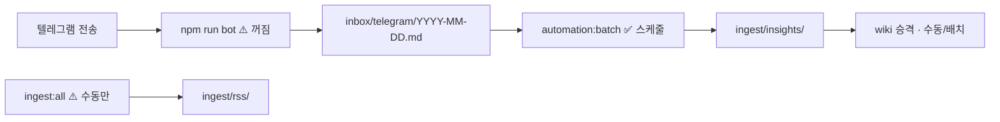

# Goal 5: Yohan OS Revival

> **이 문서 = 패치 전 큐시트.** 확인 후 「ㄱㄱ」하면 U1~U8 패치 진행.

---

## 0. 한 줄 진단 (2026-06-07 점검)

**pull 스크립트가 아니라 수집·처리 파이프라인이 멈춰 있음.**

| 구간 | 상태 | 증거 |
|------|------|------|
| `git-auto-pull` (부팅) | 동작 | 6/6·6/7 로그, `Yohan_Workspace` 전체 pull |
| `YohanOS-AutomationBatch` | 동작 but **할 일 없음** | 로그 `스캔=0 처리=0` (6/7 18:00) |
| **`npm run bot`** | **미실행** | `telegram:health` → lock none |
| 텔레그램 인박스 | **공백** | 마지막 `inbox/archive/telegram/` **5/2** |
| RSS ingest | **한 달+ 정지** | `recent_ingest` 최신 **5/6** |
| active-project | **sync Goal에 고착** | 인제스트 재가동과 무관 |

---

## 1. 파이프라인 맵 (뭘 고칠지)



**고칠 핵심:** `BOT` 상시화 + **헬스/게이트** + **active-project·문서 정렬**.
**건드리지 않음:** 커스텀 `%USERPROFILE%\git-auto-pull.ps1` (부팅 1회 sync).

---

## 2. 패치 전 — 네가 직접 확인 (5분)

아래를 **노트북에서** 한 번씩. 패치 들어가기 전 baseline.

| # | 명령 | 기대 | 지금(점검일) |
|---|------|------|-------------|
| 1 | `npm run telegram:health` | API ok | ✅ ok, **lock none** |
| 2 | `Get-ScheduledTask -TaskName YohanOS-AutomationBatch*` | Ready | ✅ Ready |
| 3 | `Test-Path memory/inbox/telegram/$(Get-Date -Format yyyy-MM-dd).md` | false면 아직 수신 없음 | ❌ 없음 |
| 4 | `Get-Content memory/logs/automation-batch.log -Tail 3` | START/DONE | ✅ 6/7 18:00, scan=0 |
| 5 | `node scripts/smoke-get-context.mjs` | profile_ok true | ✅ |

**수동 스모크 (선택, 패치 전 해도 됨):**

```powershell
cd "C:\Users\백요한\OneDrive\바탕 화면\Yohan_Workspace\Yohan OS"
npm run bot          # 터미널 유지 — 다른 창에서 6~7 진행
# 텔레그램 @yohanos_bot 에 테스트 URL 또는 스크린 1장
npm run automation:batch
npm run ingest:all   # RSS 밀린분 (시간 좀 걸림)
```

---

## 3. 패치 계획 (Units) — 승인 후 실행

| Unit | 산출물 | 목적 |
|------|--------|------|
| **U1** | `memory/active-project.yaml` | 포커스 → **yohan-os-revival** (인제스트·봇·RSS) |
| **U2** | `memory/rules/yohan-os-ops-cuesheet.md` | 1장 운영 큐시트 SoT (봇·배치·RSS·점검 주기) |
| **U3** | `multi-pc-sync.md` 보강 | 커스텀 `git-auto-pull.ps1`(부팅) vs Goal4 템플릿 **구분** 명시 |
| **U4** | `scripts/verify-goal-5.ts` | bot lock/API·inbox 경로·batch 로그 freshness·smoke |
| **U5** | `scripts/check-goal-5.mjs` | VHK gate |
| **U6** | `scripts/telegram-health.ts` (선택) | exit code 1 when lock expected but missing — **게이트용 플래그만** |
| **U7** | `docs/state/next-task.md` | Goal 5 + 일상 점검 3줄 |
| **U8** | decision + `log_evaluation` | 재가동 결정 기록 |

### Forbidden (Goal 5)

- `install-git-auto-pull.ps1 -Force` (**커스텀 ps1 덮어씀**)
- `memory/` 폴더 구조 변경
- `package.json` / `tsconfig.json` 변경 (U6는 기존 스크립트 exit code만)

### 패치 **안** 하는 것 (범위 밖)

| 항목 | 이유 |
|------|------|
| 봇을 Windows 서비스/예약작업으로 상시 등록 | 별도 Goal — 먼저 수동 `npm run bot` 안정화 |
| RSS 자동 스케줄 신규 등록 | `ingest:all`을 batch에 넣을지 decision 필요 |
| 5/2~ 오늘 텔레그램 백필 | 보내지 않은 메시지는 복구 불가 |
| 집 PC 봇 이중 기동 | `memory/.telegram-bot.lock` — **한 PC만** |

---

## 4. 패치 후 — 완료 기준 (UAT)

| # | 확인 | 통과 조건 |
|---|------|-----------|
| 1 | `npm run bot` + health | lock **있음**, API ok |
| 2 | 텔레그램 테스트 1건 | `memory/inbox/telegram/오늘.md`에 블록 추가 |
| 3 | `npm run automation:batch` | 스캔≥1 또는 처리≥1 (테스트 메시지 기준) |
| 4 | `npm run ingest:all` | `memory/ingest/rss/`에 **오늘 이후** 파일 ≥1 |
| 5 | `vhk goal check --id 5` | verify-goal-5 통과 |
| 6 | `get_context` | active_project = revival, recent_ingest 날짜 갱신 |

---

## 5. 일상 운영 큐시트 (패치 후 매일/세션)

| 언제 | 뭐 | 명령 |
|------|-----|------|
| **노트북 켤 때** | 봇 켜기 (1터미널) | `npm run bot` |
| **인사이트 보낸 뒤** | (선택) 즉시 처리 | `npm run automation:batch` — 아니면 30분 스케줄 |
| **주 1회** | RSS | `npm run ingest:all` |
| **세션 시작** | SoT | MCP `get_context` 또는 `smoke-get-context.mjs` |
| **PC 바꿀 때** | sync | `git pull` → 작업 → `git push` |
| **commit 중** | 충돌 방지 | `Disable-ScheduledTask YohanOS-AutomationBatch-30min` (multi-pc-sync) |

---

## 6. 확인 체크리스트 (Yohan 승인용)

패치 들어가기 전 아래에 체크:

- [ ] **진단 동의** — bottleneck = bot 꺼짐 + RSS 미실행 (pull 아님)
- [ ] **U1~U8 범위 OK** — 봇 서비스 등록·batch에 RSS 합치기는 **다음 Goal**
- [ ] **커스텀 git-auto-pull.ps1 유지** — install 스크립트 실행 안 함
- [ ] **봇 상시 PC** — 노트북만 vs 집 PC만 (한 곳만 `npm run bot`)
- [ ] **패치 전 스모크** — 2절 1~5번 또는 선택 스모크 완료 여부

**승인 후 한 줄:** 「ㄱㄱ」 또는 「Goal 5 패치」

---

## Completion Check (패치 후)

- [ ] U1–U8
- [ ] `vhk goal check --id 5` 통과
- [ ] UAT 1–6 통과
