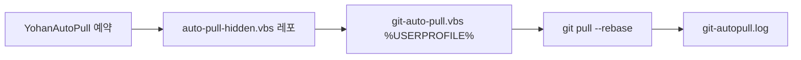

# 멀티 PC Sync 운영 규칙

## 전제

- Yohan OS는 **노트북·집 PC** 두 기기에서 같은 레포(`main`)로 작업한다.
- 런타임 SoT는 `memory/`이며, **Git이 유일한 동기 채널**이다.
- 레포 경로는 기기마다 다를 수 있다 — `YOHAN_OS_ROOT`·MCP `cwd`가 **실제 clone 위치**와 일치해야 한다.

## 버전 관리 경계 (레포 vs PC 로컬)

| 위치 | 파일·작업 | Git 추적 |
|------|-----------|----------|
| **레포** | `auto-pull-hidden.vbs`, `scripts/git-auto-pull.template.vbs`, `scripts/install-git-auto-pull.ps1`, `scripts/task-scheduler-auto-pull-setup.ps1` | ✅ |
| **레포** | `scripts/task-scheduler-setup.ps1` (`YohanOS-AutomationBatch`) | ✅ |
| **`%USERPROFILE%`** | `git-auto-pull.vbs` (실제 `git pull`·로그) | ❌ PC별 설치 |
| **Windows** | 예약 작업 `YohanAutoPull`, `YohanOS-AutomationBatch` | ❌ PC별 등록 |

pull 로그: `%USERPROFILE%\git-autopull.log`
레포 루트 **`auto-pull.ps1`은 삭제됨** — 신규 PC는 Goal 4 VBS 템플릿 또는 아래 **커스텀 ps1** 중 택1.

## Git pull — 두 가지 Setup (혼동 금지)

| Setup | 경로 | 동작 | Yohan 현재 |
|-------|------|------|------------|
| **A. 커스텀 (권장·유지)** | `%USERPROFILE%\git-auto-pull.vbs` → **`git-auto-pull.ps1`** | **부팅 1회** · `Yohan_Workspace` 전체 repo walk & pull · node 정리 · vhk doctor | ✅ **이 PC 사용 중** |
| **B. Goal 4 템플릿** | `scripts/install-git-auto-pull.ps1` → 단순 VBS | 30분 `YohanAutoPull` + Yohan OS clone 1개만 pull | 신규 PC 또는 A 미사용 시 |

- **Setup A가 있으면 `install-git-auto-pull.ps1 -Force` 실행 금지** — 커스텀 ps1 덮어씀.
- Setup A는 **인제스트·텔레그램·RSS와 무관** (git sync만).
- `YohanAutoPull` 예약 작업 **없어도** Setup A로 부팅 sync 가능.

## 신규 PC / 재설치 (Setup B만 해당)

1. clone 후 레po 루트: `install-git-auto-pull.ps1` → `task-scheduler-auto-pull-setup.ps1`
2. AutomationBatch: `scripts\task-scheduler-setup.ps1`
3. 인제스트: `memory/rules/yohan-os-ops-cuesheet.md` — **봇·RSS는 별도**

| 구성요소 | 역할 |
|----------|------|
| **`YohanAutoPull`** | 30분 주기. `wscript.exe` → 레po `auto-pull-hidden.vbs` |
| **`auto-pull-hidden.vbs`** | `%USERPROFILE%\git-auto-pull.vbs`로 위임 (창 숨김) |
| **`git-auto-pull.vbs`** | PC별 clone 경로에서 `git pull --rebase origin main` + 로그 |
| **`YohanOS-AutomationBatch`** | 하루 2회(09:00·21:00) `npm run automation:batch`. **직접 git 명령 없음** |

## AutomationBatch vs 수동 git (필수 가드)

근거: `memory/decisions/2026-05-18-1430-auto-pull-path-fix-and-index-lock.md` — 배치 실행 중 **staged 변경 소실** 관찰.

| 상황 | 규칙 |
|------|------|
| `git add` / commit 준비 / rebase 중 | **`YohanOS-AutomationBatch` 일시 중지** 또는 작업 완료까지 직렬화 |
| 장시간 편집 세션 | 배치 비활성화: `Disable-ScheduledTask -TaskName YohanOS-AutomationBatch` |
| 작업 재개 전 | `git status -b --short` 로 staged·unstaged 확인 후 배치 재활성화 |
| `YohanAutoPull` | pull-only — 인덱스 충돌 가능성은 batch보다 낮음. 그래도 **commit 직전 pull**은 수동 `git pull --rebase` 권장 |

배치가 git을 호출하지 않아도 **동시에 워크트리·인덱스를 건드리는 프로세스**가 겹치면 증상이 재발할 수 있다. “pull-only라서 안전”으로 오판하지 않는다.

## 작업 시작 시 필수

1. **풀 먼저:** `git pull --rebase origin main`
2. **상태 확인:** `git status -b --short` — ahead/behind 0에 가깝게
3. **SoT 검증:** `node scripts/smoke-get-context.mjs` — `profile_ok`·`active_project_ok` true

## 작업 중 가드

- **다른 세션**이 같은 워크트리에서 커밋하면 staged 변경이 사라질 수 있다
- **의심 신호:** `git status`가 짧은 시간 내 자체 변경, 스테이지 파일 소실
- **대응**
  1. `git log --since="10 minutes ago" --pretty=fuller`
  2. `Get-ScheduledTask | Where-Object { $_.TaskName -like 'Yohan*' }` — Running/Ready 확인
  3. AutomationBatch **Disable** 후 재현 여부 확인
  4. 다른 IDE/터미널 직렬화
  5. `Get-Process node` — dev 워처 중복 여부

## 작업 종료 시 필수

- `git push origin main` → `git status -b --short` ahead 0
- **반대 기기:** `git pull --rebase origin main` → 대시보드/`get_context` 확인

## 알려진 이슈

- **`YohanAutoPull` Access denied** — 관리자 PowerShell에서 `task-scheduler-auto-pull-setup.ps1` 재실행 또는 수동 pull
- **경로 드리프트** — Setup A: `git-auto-pull.ps1` 내 `$workspace` 수정. Setup B: `install-git-auto-pull.ps1 -Force`
- **레po 이동 후 예약 작업** — `task-scheduler-auto-pull-setup.ps1` 재실행 (진입 VBS 경로 갱신)

## 변경 절차

- 자동화·예약 작업 변경 → `append_decision` + **양 PC** 검증
- 본 규칙 갱신 → `memory/rules/rule-review-cycle.md`
